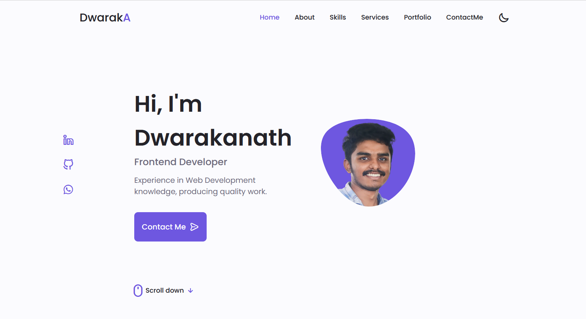
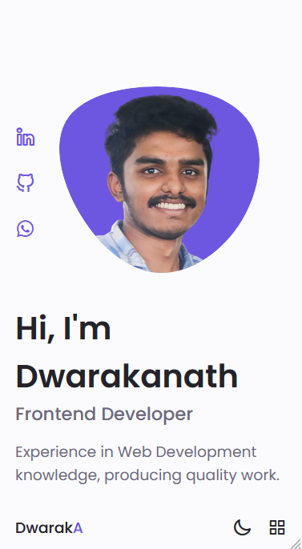
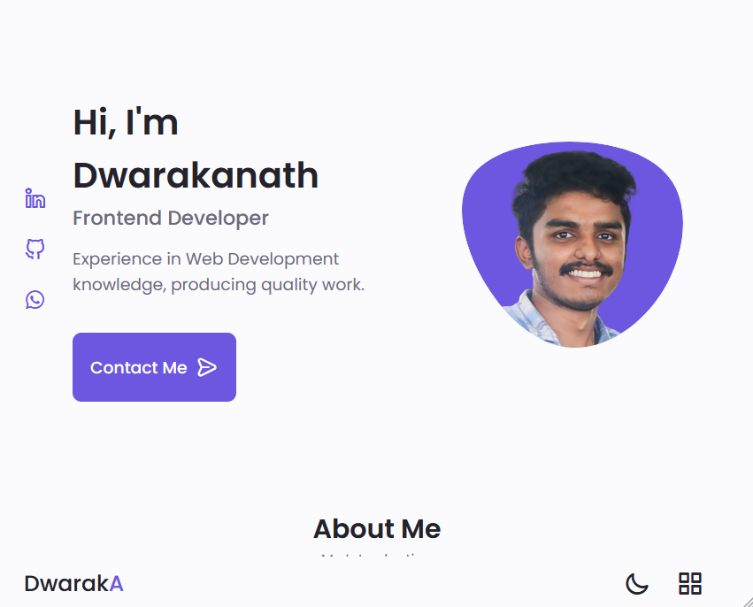
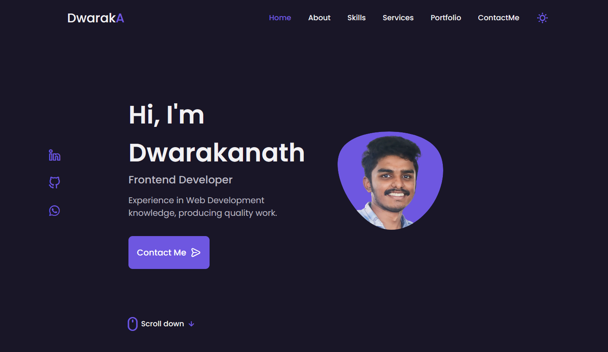

# Dwaraka's Portfolio Website

Responsive Mobile first Portfolio Website Using HTML, CSS &amp; JavaScript with Dark Theme

## Welcome! 👋

# Dwarakanath Akkala - Portfolio Website

This is a portfolio website created with the basic programming languages HTML, CSS & ES6 JavaScript to showcase my skills in the respective languages and also share information about me. Deployed the site using Netlify which is a free Hosting Service. Added dark mode throughout the whole website for best user experience with preferred theme.

## Table of contents

- [Overview](#overview)
  - [The challenge](#the-challenge)
  - [Screenshot](#screenshot)
  - [Links](#links)
- [My process](#my-process)
  - [Built with](#built-with)
  - [Useful resources](#useful-resources)
- [Author](#author)

## Overview

### The challenge

Users should be able to:

- View the optimal layout depending on their device's screen size (Mobile, Tablet, Desktop)
- See hover and focus states for interactive elements
- Toggle between Dark & Light Mode and store the user preference theme

### Screenshot

## Mobile Preview

## Tablet Preview

## Dark Mode

### Links

- Solution URL: https://github.com/DwarakanathAkkala/portfolio-website-Dwaraka
- Live Site URL: https://dwarakanath-akkala.netlify.app/

## My process

### Built with

- Semantic HTML5 markup
- ES6 JavaScript
- CSS custom properties
- CSS Grid
- Mobile-first workflow

### Useful resources

- https://iconscout.com/ - This helped me for icon in the button. I really liked this icon pack and easy to integrate.
- https://fonts.google.com/ - Used some awesome fonts from this website by linking the respective typography.
- https://www.netlify.com/ - Netlify made this project to be accessible by hosting the website for free.

## Author

- Website - https://dwarakanath-akkala.netlify.app/
- Frontend Mentor - https://www.frontendmentor.io/profile/DwarakanathAkkala
- LinkedIn - https://www.linkedin.com/in/dwarakanath-akkala-77a849136/
